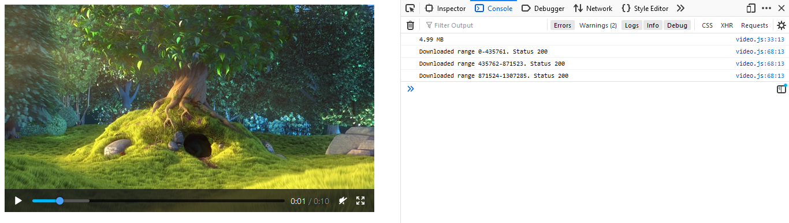

## Introduction

This is a proof-of-concept video streaming in a non-standard way.

## Prerequisite

```
.\dash-gen\mp4box.exe -dash 1000 -rap -frag-rap .\test.mp4
```

## Usage
```
deno run -A mod.ts
```

## Background

There are a lot of tutorial on building a video streaming server, but it came with some drawbacks. 

\[ 1 \] builds a server that handles HTML5 Video streaming protocol, therefore the client has no control over chunk size and bitrate request.

\[ 2 \] demonstrate the ability to stream videos in chunks by using Media Source Extensions (MSE) but provides no method to manually request partial data from server. Progressive Data ( PD ) method is used, where each new chunk of data will be 

\[ 3 \] has a list of javascript libraries that follows MPEG-DASH with DRM support, with some of them has a feature to feed custom manifest data. One can either use these libraries and create a server that handles these requests, or create a custom library that can be optimised on your need for both ends.

[ 1 ] : [http-video-stream](https://github.com/Abdisalan/blog-code-examples/tree/master/http-video-stream)

[ 2 ] : [simpl/mse](https://github.com/samdutton/simpl/tree/gh-pages/mse)

[ 3 ] : [Dynamic Adaptive Streaming over HTTP](https://en.wikipedia.org/wiki/Dynamic_Adaptive_Streaming_over_HTTP#Supported_players_and_servers)

In this sample, we'll build a video streaming server that handles non-standard request and a client app with custom method to stream the data. As a proof of concept, Deno framework are used for the server side for easier implementation and readability, and a minimal page with javascript source code are used on the client side.

## Behind the scene

The app makes use of [Media Source Extensions (MSE)](https://developer.mozilla.org/en-US/docs/Web/API/Media_Source_Extensions_API) to append and stream the video in chunks.

The app makes use of the modern `fetch()` API to request a 'manifest' and partial data when needed. 

Instead of requesting a media presentation description (MPD) file to get information on corresponding media segment and the respective resolution, we can just create an API to send necessary information in JSON format to the client. In this demo, the client fetch a `HEAD` request where the server will be returned with `clen` header that will be used to request partial data.

An additional setup to the video file is required to support DASH protocol. `MP4Box` is one of many tools available that fill this requirement.

## Limitation
- No support for any iphone devices yet ( but works on iPadOS 13+ )
- No implementation for track switching yet

## FAQs
__Is this another case of _reinventing the whell_?__
> No. This is just a proof that you have no need to follow MPEG-DASH standard and use media presentation description (MPD) manifest file in order to take control of video streaming.

> It's also act as a showcase for how flexible `MSE` is despite an unnecessary amount of setup required to properly use it.

## References
- [Implementing Adaptive HTTP Streaming Using the Web](https://archive.is/Cmxjd)